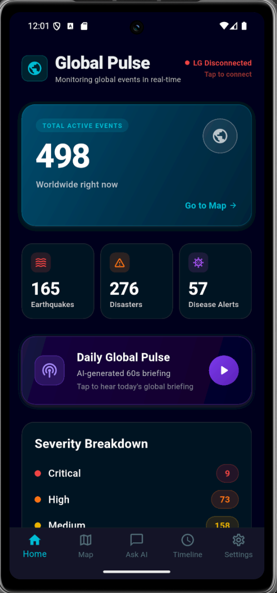
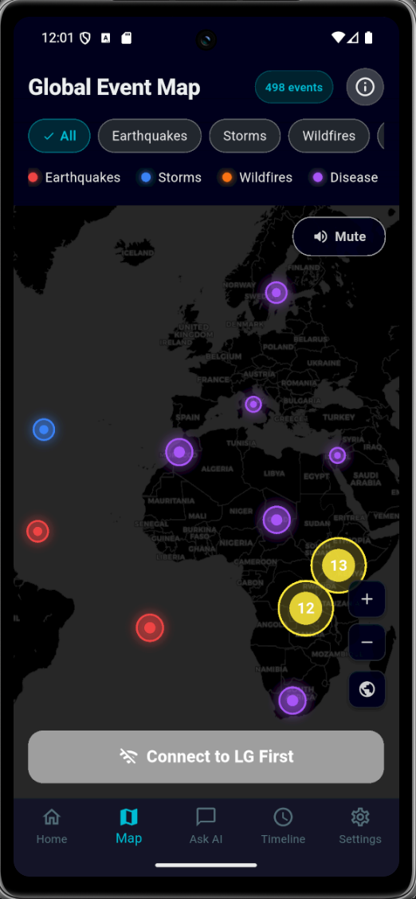
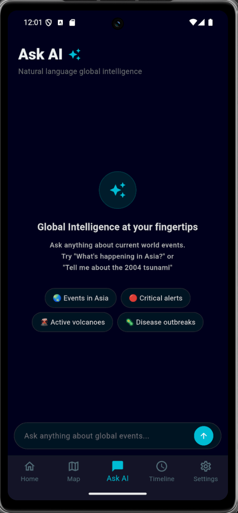
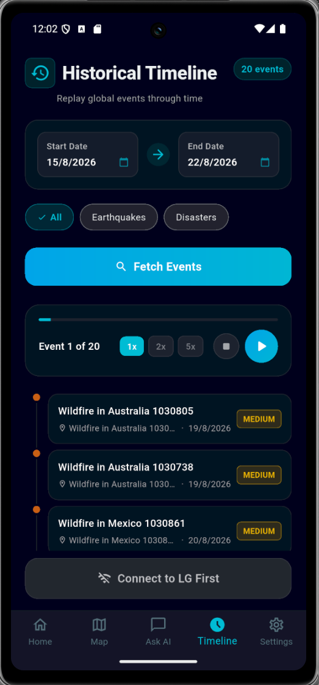
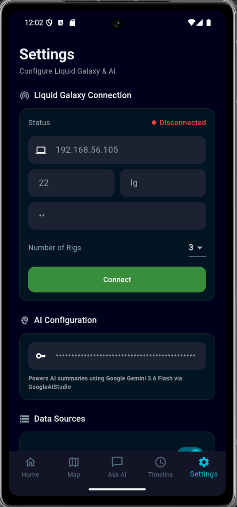

<div align="center">


# Global Pulse
### AI-Powered World Intelligence Map for Liquid Galaxy

[](https://flutter.dev)
[](https://dart.dev)
[](LICENSE)
[](https://summerofcode.withgoogle.com)
[](https://www.liquidgalaxy.eu)

**GESOC 2026 · Liquid Galaxy Lab (Google-backed)**

*A real-time global event intelligence platform that transforms the Liquid Galaxy multi-screen rig into a live world monitoring dashboard — powered by NASA, USGS, WHO data and Google Gemini AI.*

[Features](#features) · [Testing](#testing) · [Setup](#setup) · [Architecture](#architecture) · [Data Sources](#data-sources)

</div>

---

## About the Project

Global Pulse is a Flutter Android controller app built for the [Liquid Galaxy](https://www.liquidgalaxy.eu/) platform — a multi-screen Google Earth installation used by organizations worldwide for immersive geospatial visualization.

The app fetches live data from **NASA EONET**, **USGS Earthquake API**, and **WHO Disease Outbreak News**, normalizes it into a unified event model, and renders it as interactive KML markers on Google Earth across all LG screens simultaneously. An AI layer powered by **Google Gemini 3.6 Flash** generates real-time event explanations, regional intelligence summaries, and a daily 60-second spoken world briefing.

Built and submitted as a GESOC 2026 project under the Liquid Galaxy organization.

---

## Features

### 🌍 Real-Time Event Monitoring
- Live data from NASA EONET (wildfires, storms, volcanoes), USGS (earthquakes), and WHO (disease outbreaks)
- 400–600 active global events refreshed in parallel with independent failure handling
- Category-colored, severity-scaled KML markers rendered across all LG screens
- Event clustering for dense regions with color-coded cluster badges

### 🤖 Google Gemini AI Integration
- **Event Explanation** — tap any event for an AI-generated insight card
- **Regional Intelligence** — fly to any region for an AI-powered summary on the slave screen
- **Natural Language Chat** — ask "What's happening in Asia?" and get a contextual briefing with fly-to navigation
- **Historical Knowledge** — ask about past events ("2004 Indian Ocean tsunami") for a structured historical overlay
- **Daily Global Pulse** — AI-generated 60-second spoken world briefing with synchronized LG camera tour

### 🖥️ Liquid Galaxy Integration
- Full SSH/SFTP control of multi-screen LG rigs (3, 5, 7 screens — auto-configured)
- KML marker visualization on Google Earth (master screen)
- AI-powered HTML overlays on rightmost slave screen
- Global Pulse logo on leftmost slave screen on connect
- FlyTo camera navigation synced between app map and LG rig
- Quick commands: Clear KML, Clear Logo, Refresh, Reboot, Shutdown

### 🗺️ Interactive Map
- Satellite tile map with dark tint via flutter_map + Esri/CartoDB
- Category filter chips (Earthquakes, Storms, Wildfires, Disease)
- Zoom in/out controls and world reset button
- Cluster info card explaining badge colors and event types
- Mute/Unmute TTS button on map

### 📅 Historical Timeline
- Select any date range and fetch historical events from USGS and NASA archives
- Category filter (All / Earthquakes / Disasters)
- Animated timeline connector UI with severity-colored dots
- Replay on LG Rig — automated camera tour with per-event overlays and TTS narration
- Playback speed control (1x / 2x / 5x)

### 🔊 Voice Narration (TTS)
- Flutter TTS narrates event summaries, region briefings, and tour events
- Mute/Unmute toggle persists across all features
- Daily Global Pulse — 60s AI briefing spoken aloud with LG camera tour

---

## Screenshots

| Home Screen | Map Screen | Ask AI |
|:-----------:|:----------:|:------:|
|  |  |  |

| Historical Timeline | Settings | LG Rig |
|:------------------:|:--------:|:------:|
|  |  | 

---

## Testing

Tested on:
- VIT Pune LG rig (3-screen VirtualBox setup)
- Liquid Galaxy Spain rig (5-screen production setup)

---

## Tech Stack

| Category | Technology |
|----------|-----------|
| Framework | Flutter 3.x / Dart |
| State Management | BLoC (flutter_bloc ^9.1.0) |
| Map | flutter_map + CartoDB dark tiles / Esri satellite |
| AI | Google Gemini 3.6 Flash (Google AI Studio) |
| LG Communication | dartssh2 (SSH + SFTP) |
| KML Generation | xml package |
| Local Storage | Hive (manual type adapters — no build_runner) |
| HTTP Client | Dio with 15s timeouts |
| Voice | flutter_tts |
| Loading States | shimmer |
| Clustering | flutter_map_marker_cluster |

---

## Architecture

The app follows **MVVM Clean Architecture** with BLoC state management:

```
lib/
├── main.dart                          → Entry point, Hive init, DI via MultiProvider
├── app.dart                           → MaterialApp + navigation shell
├── core/
│   ├── constants/
│   │   ├── app_constants.dart         → API endpoints, Hive box names
│   │   └── country_coordinates.dart   → 195 countries hardcoded (WHO geocoding)
│   ├── theme/app_theme.dart           → Dark theme, category colors
│   └── utils/top_region_helper.dart   → Region helpers, dominant category
├── data/
│   ├── models/global_event.dart       → Core model (EventCategory, EventSeverity, EventSource)
│   ├── adapters/global_event_adapter.dart → Manual Hive type adapters
│   ├── sources/
│   │   ├── usgs_service.dart          → USGS GeoJSON parser
│   │   ├── nasa_eonet_service.dart    → NASA EONET + fallback
│   │   └── who_service.dart           → WHO DON JSON + geocoding
│   └── repositories/event_repository.dart → Parallel fetch, dedup, merge
├── domain/
│   ├── repositories/                  → Abstract interfaces
│   └── usecases/                      → Business logic layer
├── presentation/
│   ├── blocs/events/                  → EventsBloc, EventsEvent, EventsState
│   ├── screens/                       → Home, Map, AskAI, Timeline, Settings
│   ├── widgets/                       → Reusable components
│   └── navigation/main_navigation.dart
└── services/
    ├── ssh_service.dart               → SSH/SFTP LG communication
    ├── kml_service.dart               → KML generation
    ├── overlay_service.dart           → Slave screen HTML overlays
    ├── gemini_service.dart            → Google Gemini 3.6 Flash integration
    └── tts_service.dart               → Text-to-speech with mute support
```

### Data Flow

```
USGS + NASA EONET + WHO
        ↓ parallel fetch (Future.wait)
  EventRepository
        ↓ normalize + deduplicate (50km + 1hr)
   GlobalEvent model
        ↓
    EventsBloc
        ↓ filteredEvents
   Flutter UI ←──────── flutter_map markers
        ↓
   KML Service → SSH → LG rig (master screen)
        ↓
  Gemini AI → Overlay Service → SFTP → slave screen
```

---

## Setup

### Prerequisites

- Flutter 3.x SDK
- Android device or emulator (API 21+)
- Liquid Galaxy rig (optional — app works standalone)
- Google AI Studio API key (free at [aistudio.google.com](https://aistudio.google.com))

### Installation

```bash
# Clone the repository
git clone https://github.com/DevAni27/LG-Intelligence-Map.git
cd global-pulse-lg

# Install dependencies
flutter pub get

# Run on device
flutter run

# Build release APK
flutter build apk --split-per-abi --release
```

> Use `build/app/outputs/flutter-apk/app-arm64-v8a-release.apk` for modern Android devices.

### ProGuard Rules

If minification is enabled, add to `android/app/proguard-rules.pro`:

```pro
-keep class io.flutter.** { *; }
-keep class io.flutter.plugins.** { *; }
-dontwarn com.google.android.play.core.**
-dontwarn io.flutter.embedding.engine.deferredcomponents.**
```

---

## LG Rig Connection Guide

### Step 1 — Connect in Settings

Open the app → Settings tab → enter your rig credentials:

| Field | Value |
|-------|-------|
| IP Address | Your LG master (lg1) IP |
| Port | 22 |
| Username | lg |
| Password | lg |
| Number of Rigs | 3 / 5 / 7 (match your setup) |

Tap **Connect**. The Global Pulse logo appears on the leftmost slave screen automatically.

### Step 2 — Add Gemini API Key

Settings → AI Configuration → paste your Google AI Studio key → Save.

Get a free key at [aistudio.google.com](https://aistudio.google.com) → Get API Key.

### Step 3 — Test

- **Map** → Tap "Fly to View on LG" — rig camera flies + overlay appears on slave screen
- **Ask AI** → Ask "What's happening in India?" → fly-to card appears → tap to navigate rig
- **Home** → Tap Daily Global Pulse play button → 60s AI briefing + rig tour

### Slave Screen Assignments

| Rig Size | Overlay Screen | Logo Screen |
|----------|---------------|------------|
| 3 screens | slave_2 (lg2) | slave_3 (lg3) |
| 5 screens | slave_3 (lg3) | slave_5 (lg5) |
| 7 screens | slave_4 (lg4) | slave_7 (lg7) |

---

## Data Sources

| Source | Data | Update Frequency | Auth |
|--------|------|-----------------|------|
| [USGS Earthquake API](https://earthquake.usgs.gov/earthquakes/feed/v1.0/summary/all_day.geojson) | Real-time earthquakes worldwide | Continuous | None |
| [NASA EONET](https://eonet.gsfc.nasa.gov/api/v3/events/geojson) | Wildfires, storms, volcanoes | Daily | None |
| [WHO Disease Outbreak News](https://www.who.int/api/news/diseaseoutbreaknews) | Active disease outbreaks | As published | None |

### Geocoding
- 195 countries hardcoded in `country_coordinates.dart`
- Nominatim (OpenStreetMap) for sub-national locations
- Hive cache for Nominatim results

### Deduplication
Two events are duplicates if: same category + within 50km + within 1 hour of each other.

---

## AI Features

All AI features use **Google Gemini 3.6 Flash** via Google AI Studio.

| Feature | Description | Tokens Used |
|---------|-------------|-------------|
| Event Explanation | AI insight for tapped event | ~200 |
| Region Summary | Slave screen overlay for visible area | ~300 |
| Natural Language Query | Chat with fly-to navigation | ~400 |
| Historical Event | Past event structured overlay | ~400 |
| Daily Global Pulse | 60-second spoken world briefing | ~600 |

**Free tier limits:** 15 RPM, 1,500 RPD — sufficient for normal usage.

---

## Known Limitations

- **GDELT** conflicts data source integrated but silently falls back due to public API rate limiting — will be addressed in future iteration
- **WHO historical data** — WHO API only returns current outbreaks, no date filtering available
- **College WiFi / Client isolation** — LG rig connection requires device and rig on same non-isolated network
- **Google Earth browser** — Overlay HTML uses older CSS subset (`background-size: cover` instead of `object-fit`)
- **Rate limits** — Heavy testing may exhaust Gemini free tier daily quota (resets midnight Pacific Time)

---

## LG Rig Rules (Critical)

These rules were learned from experience — violating them can corrupt the rig:

```
✅ ALWAYS use lg1 hostname (not IP) in kmls.txt URLs
✅ ALWAYS place KML files in /var/www/html/ root
✅ ALWAYS use utf8.encode() for SFTP uploads
✅ ALWAYS call _setSlaveRefresh() after overlay writes

❌ NEVER write to master.kml or myplaces.kml directly
❌ NEVER echo "reload" to query.txt
❌ NEVER use codeUnits for SFTP uploads
❌ NEVER place KML in /var/www/html/kml/ subdirectory (for main KML)
```

---

## Contributing

This project was developed as a GESOC 2026 submission. Contributions, issues, and feature requests are welcome.

```bash
# Create a feature branch
git checkout -b feature/your-feature-name

# Commit changes
git commit -m "feat: your feature description"

# Push and create PR
git push origin feature/your-feature-name
```

---

## Acknowledgements

This project was built during **GESOC 2026** under the **Liquid Galaxy Lab** organization, backed by Google.

Special thanks to:

- **Mudgil** (Primary Mentor) — Architecture reviews, GitHub PR feedback, and pushing for production-quality code throughout the program
- **Andreu** (Mentor, LG AI Infrastructure) — Liquid Galaxy AI integration guidance and Spain rig access for testing
- **Liquid Galaxy Lab Team** — For building and maintaining an incredible open-source platform
- **Google** — For creating GESOC and giving students the opportunity to contribute to real-world open source software

---

## License

This project is licensed under the MIT License — see the [LICENSE](LICENSE) file for details.

---

<div align="center">

Built with ❤️ by **Pranshu** · VIT Pune · GESOC 2026

[](https://github.com/DevAni27)

*Global Pulse is published on the Liquid Galaxy App Store*

</div>